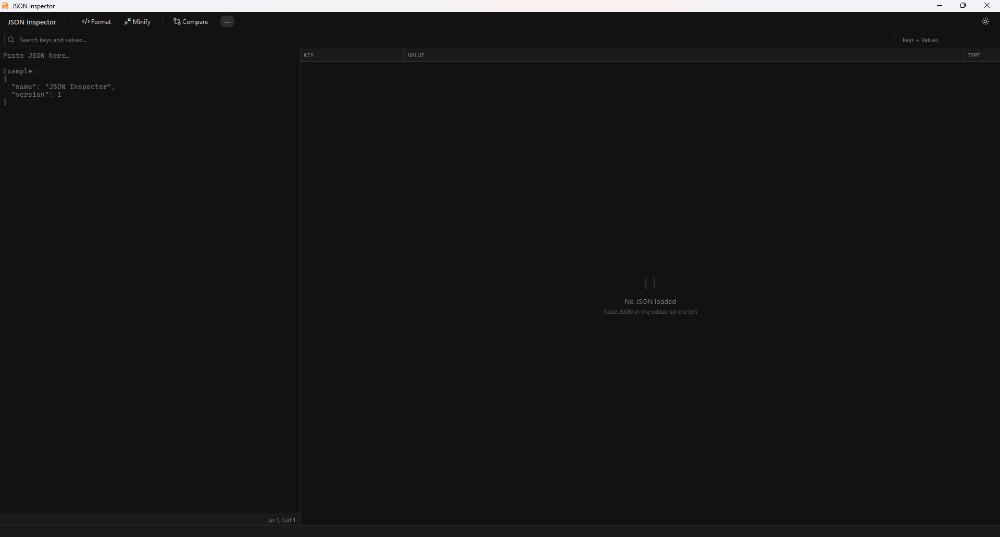
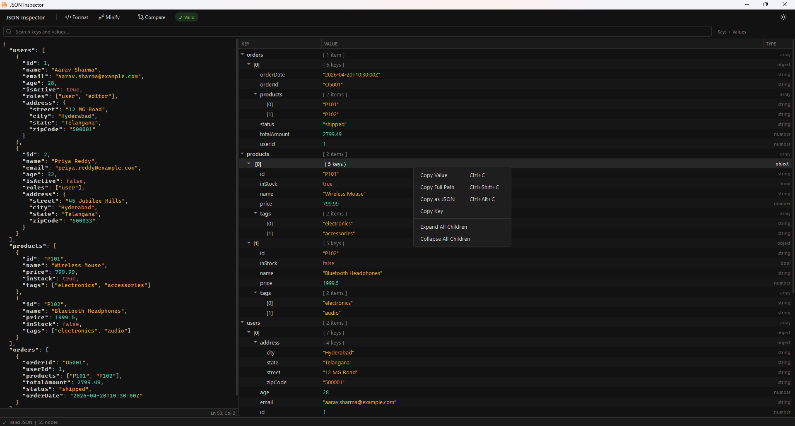
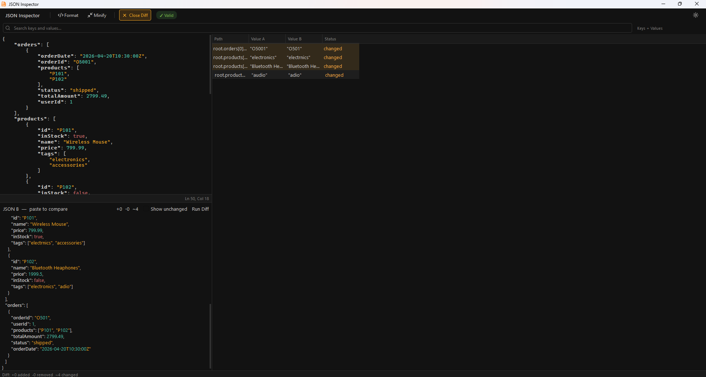
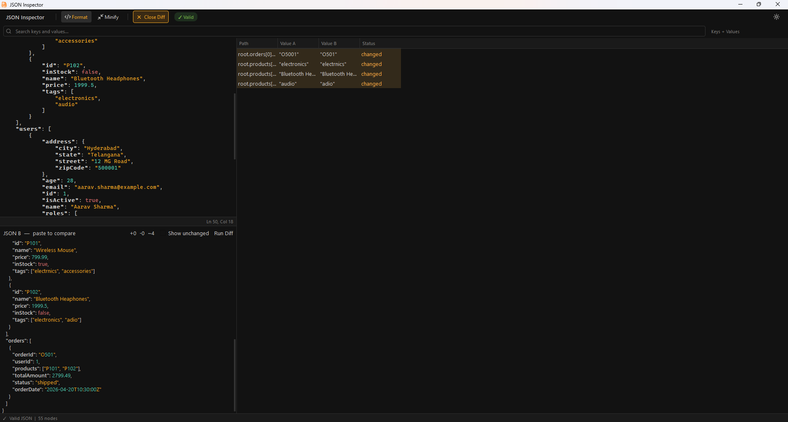
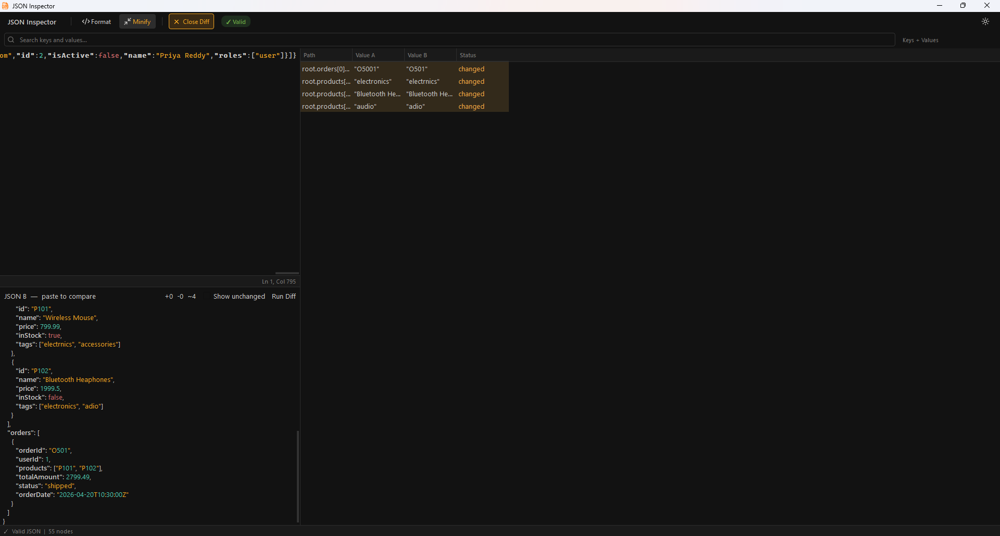
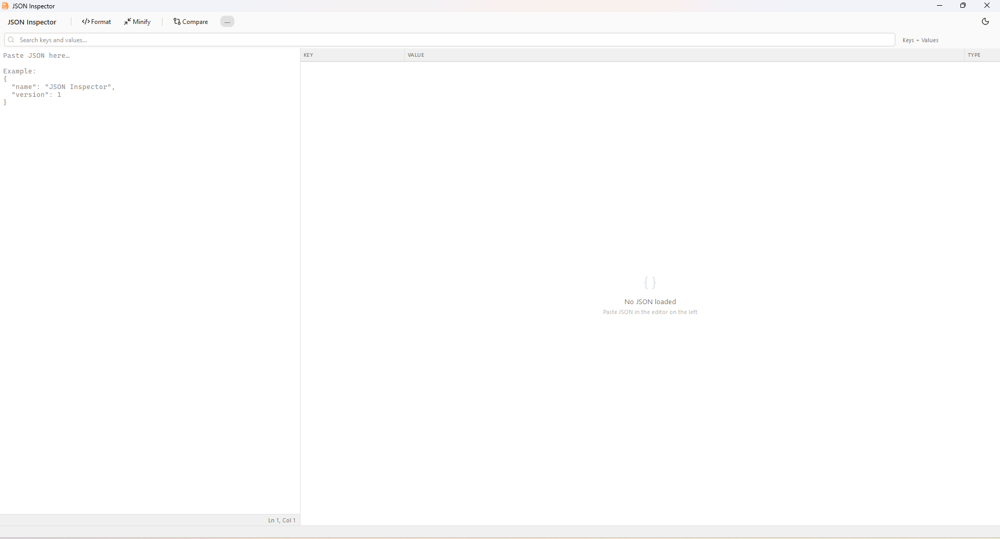
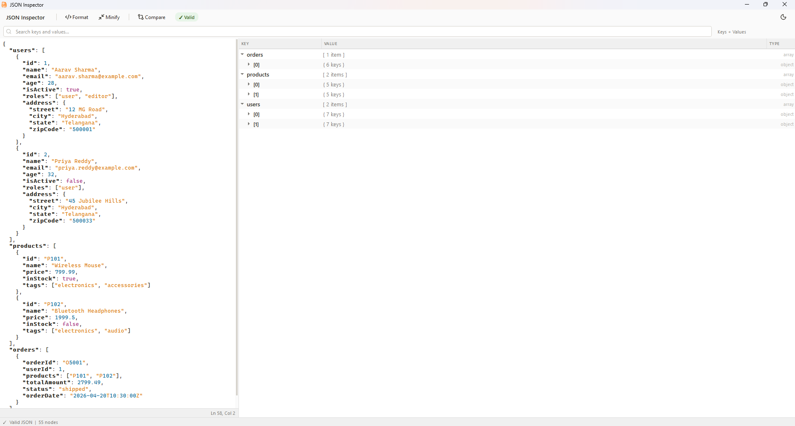
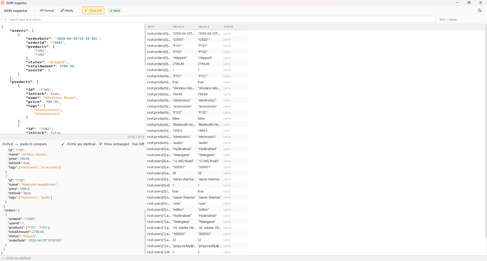
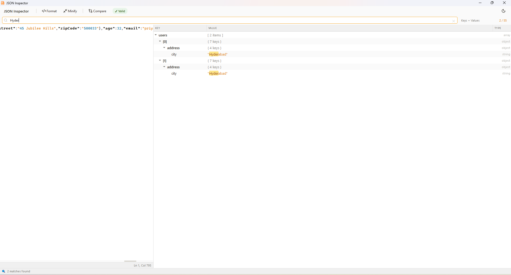

<div align="center">


# 🔍 JSON Inspector

**A minimalistic, high-performance JSON viewer and diff tool built with modern C++17 and the Qt 6 framework.**

[](https://isocpp.org/)
[](https://www.qt.io/)
[](LICENSE.md)
[]()
[]()

*Parse. Search. Diff. All in one elegant tool.*

</div>

---

## 📋 Table of Contents

- [Overview](#-overview)
- [Features](#-features)
- [Interface Gallery](#-interface-gallery)
- [Architecture](#-architecture)
- [Build & Deployment](#-build--deployment)
- [Usage Guide](#-usage-guide)
- [License](#-license)

---

## 🧭 Overview

**JSON Inspector** is a developer-centric desktop application designed to make working with complex JSON payloads effortless. Whether you're parsing deeply nested API responses, debugging configuration files, or comparing payloads across environments, JSON Inspector provides a precise, distraction-free environment built around a strict grid-based aesthetic.

It is built entirely with **C++17** and **Qt 6 Widgets**, ensuring native performance across Windows, macOS, and Linux with zero runtime dependencies.

---

## ✨ Features

### 🎨 Minimalistic UI/UX
Flat design with tight margins, zero-background interactive labels, and fully custom QSS styling. Every pixel is intentional — no bloat, no clutter.

### 🌓 Dynamic Theming
Seamlessly switch between **Light**, **Dark**, and the custom signature **Amber** brand palette at runtime — no restart required. All themes are driven by a live QSS stylesheet engine.

### 🔍 Deep Search & Filtering
Powered by an interactive `QSortFilterProxyModel`, you can isolate specific keys or values instantly. A custom substring highlight delegate visually marks all matches inline within the tree view.

### ⚖️ Intelligent Diff Engine
Compare two JSON payloads side-by-side with a granular diff engine that surfaces `added`, `removed`, and `changed` nodes with clear per-metric counters.

### ⚡ Robust Error Handling
Real-time syntax validation with smooth animated error banners and exact-character cursor tracking, so you always know precisely where a malformed payload breaks.

### 🌲 Interactive Tree Navigation
Expand, collapse, and navigate deeply nested JSON structures through a clean tree view model. Large payloads remain responsive thanks to efficient `QStandardItemModel` rendering.

---

## 📸 Interface Gallery

<h3 align="center">🌙 Dark Theme — Amber Brand Palette</h3>

<table align="center">
  <tr>
    <td align="center">
      
      <br/><sub><b>Main Editor</b></sub>
    </td>
    <td align="center">
      
      <br/><sub><b>Tree Navigation</b></sub>
    </td>
    <td align="center">
      
      <br/><sub><b>Diff Engine</b></sub>
    </td>
  </tr>
  <tr>
    <td align="center">
      
      <br/><sub><b>Search & Filtering</b></sub>
    </td>
    <td align="center" colspan="2">
      
      <br/><sub><b>Error Handling & Validation</b></sub>
    </td>
  </tr>
</table>

<br/>

<h3 align="center">☀️ Light Theme</h3>

<table align="center">
  <tr>
    <td align="center">
      
      <br/><sub><b>Clean Light UI</b></sub>
    </td>
    <td align="center">
      
      <br/><sub><b>Tree Expansion</b></sub>
    </td>
  </tr>
  <tr>
    <td align="center">
      
      <br/><sub><b>Light Diff View</b></sub>
    </td>
    <td align="center">
      
      <br/><sub><b>Search Highlights</b></sub>
    </td>
  </tr>
</table>

---

## 📂 Architecture

JSON Inspector strictly separates UI logic from data modeling for scalability and testability.

```
json-inspector/
├── core/           # JSON parsing, validation, and diffing algorithms
├── models/         # Custom QStandardItemModel and proxy models for tree views
├── ui/             # Polished custom widget classes, item delegates, and search proxies
├── theme/          # Dynamic QSS stylesheet management and JSON syntax highlighting
├── utils/          # Application-wide constants and brand color definitions
└── screenshot/     # UI preview images
```

| Module | Responsibility |
|--------|---------------|
| `core/` | Parsing, tokenizing, validation, and diff computation |
| `models/` | Tree data models, `QSortFilterProxyModel` subclasses |
| `ui/` | All QWidget subclasses, custom delegates, layout managers |
| `theme/` | QSS loading, hot-swap theming, syntax highlight rules |
| `utils/` | Shared enums, color constants, Amber brand palette definitions |

---

## 🚀 Build & Deployment

### Prerequisites

| Requirement | Version |
|-------------|---------|
| Qt (Widgets module) | 6.0 or higher |
| C++ Compiler | C++17 compatible (`llvm-mingw`, `MSVC`, `GCC`, `Clang`) |
| Build System | `qmake` (ships with Qt) |

### Compilation

```bash
# 1. Clone the repository
git clone https://github.com/sekhar-dev79/json-inspector.git
cd json-inspector

# 2. Generate the Makefile
qmake JsonInspector.pro

# 3. Build the project
make            # Linux / macOS
mingw32-make    # Windows (MinGW)
```

### Release Build

```bash
qmake JsonInspector.pro CONFIG+=release
make
```

### Deployment Notes

- **Windows:** Use `windeployqt` after building to bundle the required Qt DLLs alongside the executable.
- **macOS:** Use `macdeployqt` to create a self-contained `.app` bundle.
- **Linux:** Ensure Qt 6 Widgets libraries are present on the target system, or bundle them manually.

---

## 📖 Usage Guide

### Viewing JSON
Paste or load any JSON payload into the main editor. The tree view automatically updates as you type. Use the expand/collapse controls to navigate nested structures.

### Searching & Filtering
Type into the search bar to filter the tree view in real time. Matching keys and values are highlighted inline. Press `Escape` to clear the filter and restore the full tree.

### Running a Diff
Open the **Diff** tab and paste two JSON payloads into the left and right panels. The engine computes and highlights added, removed, and changed nodes, with a summary metric bar at the top.

### Switching Themes
Use the **Theme** selector in the toolbar to switch between Light, Dark, and Amber modes instantly. The change applies live across all open panels.

### Error Handling
If your JSON contains a syntax error, an animated banner appears below the editor pinpointing the exact character offset. Fix the error and the banner dismisses automatically.

---

## 📜 License

This project is licensed under the **MIT License** — see the [LICENSE.md](LICENSE.md) file for full details.

---

<div align="center">

Built with ❤️ using **C++17** and **Qt 6**

<br/>

⭐ If you find this project useful, consider giving it a star!

</div>
